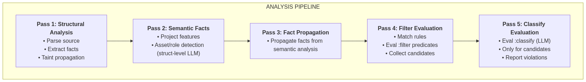

# Skry
**Skry** is an experimental security tool for [Sui Move](https://www.sui.io/move) smart contracts that combines static program analysis with LLM-based classification.

> ⚠️ **Tool status:** proof of concept.
> The tool works, reproduces known critical vulnerabilities, and detects subtle design issues, but requires further work to handle more complex and advanced Sui Move patterns. See [the announcement](http://nowarp.io/blog/skry) for details.

The tool is focused on access control, governance and centralization issues not detectable by pure static analysis. See [`rules`](./rules) for all the supported rules.

## Quickstart

Installation:
```bash
git clone --recursive https://github.com/nowarp/skry
pip install -r requirements.txt
```

Set environment variables according to your setup:

```bash
# `claude-cli` uses local Claude Code
# `api` uses the DeepSeek API and requires DEEPSEEK_API_KEY to be set
# `manual` prints complete prompts for copy-paste into a web interface – useful for debugging
export SKRY_LLM_MODE=manual|api|claude-cli
```

Run the analyzer on Move source files:

```bash
python3 src/main.py <source_path> --skip-tests
```

## How it works

The overall pipeline architecture is shown below:



Skry uses static analysis to narrow down candidates, then applies targeted LLM classification, followed by interprocedural and cross-module taint propagation to detect issues. This avoids most LLM hallucinations and reaches bugs pure static analysis can't.

See [Resources](#resources) for more information.

## Resources
* **[docs/architecture.md](docs/architecture.md)**: Describes the architecture of the tool beyond basic usage. Useful for contributors or developers examining the source code.
* **[nowarp.io: Skry: Hybrid LLM Static Analysis for Sui Move](http://nowarp.io/blog/skry)**: The blog post introducing the tool, describing in detail its design, implementation, and evaluation on real Sui Move contracts.
