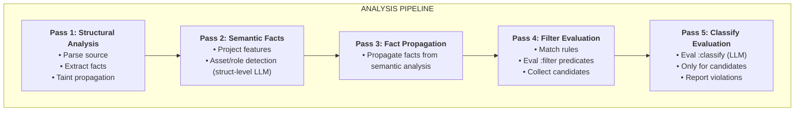

# Skry Architecture

Static analyzer for Sui Move smart contracts. Combines static analysis analysis with LLM-powered classification.

**Core idea**
* Parse source code.
* Collect Datalog-style structural facts.
* Propagate facts using interprocedural, cross-module taint analysis.
* Issue targeted LLM queries in an isolated context to extract project-specific semantic facts.
* Propagate semantic facts back into the analysis.
* Evaluate security rules written in a Hy-based eDSL.
* Detect and report violations using combined structural and semantic facts.

**Benefits**
* Enables detection of bugs that are not reachable with purely static analysis.
* Uses semantic information derived from project context.
* Extensible via user-defined rules in the existing DSL.
* Does not require modifications to the core analysis pipeline.

## Analysis Pipeline



| Pass | Name | What it does |
|------|------|--------------|
| 1 | Structural Analysis | Parse files, extract facts, run taint propagation |
| 2 | Semantic Facts | Project features (versioning, ACL) + struct-level LLM classification |
| 3 | Fact Propagation | Propagate facts from semantic analysis |
| 4 | Filter Evaluation | Match rules, evaluate `:filter` predicates, collect candidates |
| 5 | Classify Evaluation | Evaluate `:classify` (LLM) only for filter candidates |

## Directory Structure

```
src/
├── main.py                 # Entry point, pass orchestration
├── pipeline.py             # Filter/classify pipeline (Candidate, FilterResult)
├── cli/                    # CLI utilities
│   ├── helpers.py          # Environment validation, file collection
│   └── debug.py            # Debug utilities available from CLI
│
├── core/                   # Shared infrastructure
│   ├── facts.py            # Fact dataclass, FactSchema registry, fact helpers
│   ├── context.py          # ProjectContext (+ function_index property), SourceFileContext
│   ├── cache.py            # Fact caching (CACHE_DIR = .skry_cache)
│   └── utils.py            # Logging and shared utilities
│
├── analysis/               # Structural analysis passes
│   ├── structural.py       # Main StructuralBuilder class
│   ├── transfers.py        # Transfer detection + propagation
│   ├── access_control.py   # Capability-related facts, sender/role/transfer/InitImpl checks
│   ├── orphans.py          # Orphan detection (TxContext usage tracking, roles, events)
│   ├── field_checks.py     # Generic field-based check derivation (ReadsField + condition → checks)
│   ├── field_tracking.py   # Field write detection (WritesField, TransitiveWritesField, etc.)
│   ├── pause.py            # Pause infrastructure detection (uses field_checks pattern)
│   ├── patterns.py         # Self-recursion, same-module, asset and roles creation
│   ├── user_assets.py      # User asset container detection via usage patterns
│   ├── ownership_transfer.py # Single-step ownership transfer detection
│   ├── derived_facts.py    # Compute derived facts (OperatesOnSharedObject, HasPrivilegedSetter, WritesProtocolInvariant, etc.)
│   ├── call_graph.py       # Call graph utilities (build_global_call_graph, is_transitively_called_from)
│   ├── function_index.py   # FunctionIndex: O(1) function metadata lookups (visibility, AC flags)
│   ├── cap_graph.py        # Capability graph visualization (dump_cap_graph_to_dir)
│   └── cap_ir.py           # Capability IR analysis (address sources, takeovers, leaks)
│
├── taint/                  # Taint analysis module
│   ├── __init__.py         # Exports run_structural_taint_analysis, guard functions
│   ├── analysis.py         # Intraprocedural taint propagation
│   │                       #   - TaintState: tracks tainted/sanitized vars
│   │                       #   - propagate_taint(): fixed-point iteration
│   │                       #   - analyze_sink_reachability(): taint -> sink facts
│   ├── interproc.py        # Interprocedural taint analysis
│   │                       #   - FunctionSummary: param -> sink/return tainting
│   │                       #   - compute_function_summary(): build summaries
│   │                       #   - run_interprocedural_analysis(): module-wide IPA
│   │                       #   - run_structural_taint_analysis(): main entry point
│   ├── guards.py           # Per-sink guard tracking
│   │                       #   - collect_function_guards(): gather guard facts
│   │                       #   - generate_guarded_sink_facts(): join sinks with guards
│   │                       #   - enrich_summaries_with_guards(): add guards to summaries
│   ├── cross_module.py     # Cross-module taint propagation
│   │                       #   - propagate_taint_across_modules(): apply summaries
│   └── generics.py         # Generic type validation analysis (taint-style)
│                           #   - GenericTypeState: tracks validated types per function
│                           #   - GenericTypeSummary: interprocedural summaries
│                           #   - propagate_generic_validation(): intraprocedural analysis
│                           #   - apply_generic_summaries(): interprocedural propagation
│                           #   - detect_extracted_value_returned(): FP suppression for
│                           #     utility functions that return extracted value
│                           #   - generate_generic_type_facts(): main entry point
│
├── rules/                  # Rule engine
│   ├── ir.py               # Rule AST types, property definitions
│   ├── hy_loader.py        # Hy rule loader (HyRule dataclass)
│   ├── hy_bridge.py        # Bridge for Hy -> Python semantic checks
│   ├── eval_context.py     # EvalContext dataclass for rule evaluation
│   ├── utils.py            # Shared utilities (find_hy_bindings)
│   └── hy/                 # Hy support modules
│       ├── macros.hy       # defrule macro (:filter/:classify clauses)
│       ├── builtins.hy     # Pure Hy checks (fact lookups)
│       └── bridge.hy       # Hy wrappers for Python checks
│
├── semantic/               # Semantic property checking
│   ├── checker.py          # SemanticChecker dispatcher
│   ├── helpers.py          # Binding helpers, fact mapping utilities
│   ├── taint_checks.py     # tainted_* property checks
│   ├── sanitized_checks.py # sanitized_* property checks
│   ├── access_checks.py    # checks_role, checks_sender, admin asserts
│   ├── structural_checks.py # orphan_*, is_init, public, entry, missing_*
│   ├── complexity_checks.py # version_check, unused, duplicated_branch_*
│   ├── defi_checks.py      # transfer, oracle, price, flash_loan, slippage
│   └── llm_facts.py        # LLM semantic fact generators
│                           #   - generate_access_control_fact()
│                           #   - generate_slippage_fact()
│                           #   - generate_unlock_fact()
│                           #   - generate_drain_fact()
│                           #   - generate_transfer_fact()
│                           #   - generate_sensitive_setter_fact()
│
├── llm/                    # LLM infrastructure
│   ├── api/                # LLM API providers (pluggable)
│   │   ├── base.py         # LLMProvider abstract interface, LLMResponse
│   │   ├── deepseek.py     # DeepSeek API implementation
│   │   ├── cli_base.py     # Base class for CLI-based LLM providers
│   │   └── claude_cli.py   # Claude CLI provider
│   ├── client.py           # High-level LLM client: call_llm_json(), call_llm_batch()
│   ├── cache.py            # LLMCache class and cache instances
│   ├── prompt_cache.py     # PromptCache for caching LLM responses by prompt hash
│   ├── prompts.py          # Prompt builders, FunctionContextBuilder (shared context for LLM)
│   ├── classify.py         # VulnerabilityContext, candidate counting
│   └── sensitivity.py      # Field sensitivity analysis (uses FunctionContextBuilder)
│
├── prompts/                # Jinja2 LLM prompt templates
│
├── move/                   # Move language frontend
│   ├── parse.py            # Tree-sitter parsing, fact extraction
│   ├── extract.py          # Source extraction (functions, structs, docstrings)
│   ├── ir.py               # Function/Statement IR
│   ├── cst_to_ir.py        # CST -> IR conversion
│   ├── cfg.py              # Control flow graph
│   ├── collectors.py       # AST collectors (calls, assignments, etc.)
│   ├── imports.py          # Module/import parsing
│   ├── types.py            # Type string utilities (strip refs, generics, FQN handling)
│   ├── utils.py            # SourceLocation, line mapping
│   ├── taint_facts.py      # Taint source/sink base facts
│   └── sui_patterns.py     # Sui-specific patterns: callees (transfer, share, freeze, sender), detect_transfer_patterns()
│
├── features/               # Project-level feature detection
│   ├── base.py             # FeatureDetector base class
│   ├── runner.py           # FeatureRunner
│   ├── version.py          # Version checking detection
│   ├── pause.py            # Global pause mechanism detection
│   └── category.py         # Project category classification (defi_dex, gaming, etc.)
│
├── reporter.py             # Violation reporting
└── semantic_facts_builder.py # Pass 2: features + asset/role detection

rules/                   # Hy rule files
├── access_control.hy       # Access control rules
├── structural.hy           # Structural/code quality rules
├── code_quality.hy         # Code quality lints
└── centralization.hy       # Centralization risk rules (admin drain, etc.)
```

## Key Concepts

### Fact
A Datalog-style tuple representing code properties. All facts are registered in `FACT_REGISTRY`:
```python
Fact("Fun", ("module::function_name",))
Fact("Transfers", ("module::func", True))
Fact("TaintedAtSink", ("func", "source", "stmt_id", "transfer_recipient", ""))
```

### FactSchema
Schema defining fact structure (in `core/facts.py`):
```python
define_fact("Transfers", (("func_name", str), ("transfers", bool)),
            "performs a value or asset transfer")
```

### HyRule
Rules are written in Hy (Lisp dialect for Python). See [docs/rules_syntax.md](rules_syntax.md) for full syntax reference.

Each rule has:
- `name`: Rule identifier
- `severity`: info/low/medium/high/critical
- `match_pattern`: Pattern type (fun/role/event/const/mutable-config-field/writes-protocol-invariant)
- `match_modifiers`: Optional modifiers (public/entry)
- `filter_clause`: Hy predicate for structural filtering (cheap, no LLM)
- `classify_clause`: Hy predicate for LLM classification (expensive, demand-driven)

### Binding
Maps pattern variables to concrete values:
```python
{"f": "module::withdraw"}  # For fun pattern
{"r": "AdminCap"}          # For role pattern
{"f": ("func", "Struct", "field")}  # For writes-protocol-invariant (3-tuple)
```

### EvalContext
Context passed to Hy predicates:
```python
@dataclass
class EvalContext:
    ctx: ProjectContext       # Global analysis context
    source_file: str         # Current source file
    source_code: str         # Source code content
    root: Any                # Tree-sitter root node
```

## Taint Analysis Architecture

```
┌─────────────────────────────────────────────────────────────────┐
│                    src/move/taint_facts.py                      │
│  Generate BASE facts: TaintSource, Assigns, CallResult, Sinks   │
└───────────────────────────────┬─────────────────────────────────┘
                                │
                                ▼
┌─────────────────────────────────────────────────────────────────┐
│                    src/taint/analysis.py                        │
│  INTRAPROCEDURAL propagation:                                   │
│  - propagate_taint(): fixed-point dataflow                      │
│  - analyze_sink_reachability(): Tainted* facts                  │
└───────────────────────────────┬─────────────────────────────────┘
                                │
                                ▼
┌─────────────────────────────────────────────────────────────────┐
│                    src/taint/interproc.py                       │
│  INTERPROCEDURAL analysis:                                      │
│  - FunctionSummary: "param N tainted → sink/return"             │
│  - Apply summaries at call sites                                │
│  - Fixed-point iteration across module                          │
└─────────────────────────────────────────────────────────────────┘
```

Key taint facts:
- `TaintSource(func, param, idx)` - User input parameter
- `Tainted(func, var)` - Variable is tainted
- `TaintedAtSink(func, source, stmt_id, sink_type, cap)` - Tainted value reaches sink
  - sink_type: "transfer_recipient", "transfer_value", "state_write", "amount_extraction", "object_destroy", "loop_bound", "event_field", "generic"
- `SanitizedAtSink(func, source, stmt_id, sink_type, cap)` - Value sanitized before reaching sink

Key generic type facts:
- `UnvalidatedTypeAtSink(func, type_var, stmt_id, callee)` - Generic type param reaches sink without validation
- `ValidatedTypeAtSink(func, type_var, stmt_id, callee)` - Generic type param reaches sink with validation
- `ExtractedValueReturned(func, type_var)` - Extracted value is returned (not transferred), suppresses FP in utility functions

## LLM Semantic Facts

Generated by `:classify` pass for candidates that passed structural `:filter`.
Each fact generator (in `semantic/llm_facts.py`) creates EITHER a positive (safe) OR negative (vulnerable) fact:

| Generator Function | Positive Fact (safe) | Negative Fact (vulnerable) |
|-------------------|---------------------|---------------------------|
| `generate_access_control_fact` | `LLMHasAccessControl(func)` | `LLMVulnerableAccessControl(func)` |
| `generate_slippage_fact` | `LLMHasSlippageProtection(func)` | `LLMMissingSlippage(func)` |
| `generate_unlock_fact` | `LLMHasUnlockOnAllPaths(func)` | `LLMMissingUnlock(func)` |
| `generate_drain_fact` | `LLMCallerOwnsValue(func)` | `LLMArbitraryDrain(func)` |
| `generate_transfer_fact` | `LLMValueReachesRecipient(func)` | `LLMMissingTransfer(func)` |
| `generate_sensitive_setter_fact` | `LLMHasSetterAuth(func)` | `LLMSensitiveSetter(func)` |

LLM metadata (reasoning, call traces) is cached separately in `.skry_cache/llm_*` directories.

## Rule System Architecture

```
┌─────────────────────────────────────────────────────────────────┐
│                        rules/*.hy                               │
│  (defrule name :match [...] :filter (...) :classify (...))     │
└───────────────────────────────┬─────────────────────────────────┘
                                │ load_hy_rules()
                                ▼
┌─────────────────────────────────────────────────────────────────┐
│                    src/rules/hy_loader.py                       │
│  HyRule(name, severity, match_pattern, filter_clause,          │
│         classify_clause)                                        │
└───────────────────────────────┬─────────────────────────────────┘
                                │
              ┌─────────────────┴─────────────────┐
              ▼                                   ▼
┌──────────────────────────┐        ┌──────────────────────────┐
│  Pass 3: Filter          │        │  Pass 5: Classify        │
│  filter_clause(f,facts)  │        │  classify_clause(f,facts)│
│  Cheap structural checks │        │  LLM calls (demand-only) │
└──────────────────────────┘        └──────────────────────────┘
              │                                   │
              ▼                                   ▼
┌─────────────────────────────────────────────────────────────────┐
│                   src/rules/hy/bridge.hy                        │
│  Hy wrappers: (tainted-recipient? f facts ctx) -> call-check    │
└───────────────────────────────┬─────────────────────────────────┘
                                │ call_check("check_name", ...)
                                ▼
┌─────────────────────────────────────────────────────────────────┐
│                  src/rules/hy_bridge.py                         │
│  Python bridge: routes to semantic/*_checks.py or llm/classify  │
└───────────────────────────────┬─────────────────────────────────┘
                                │
                                ▼
┌─────────────────────────────────────────────────────────────────┐
│  semantic/*_checks.py - Fact lookups, CFG analysis              │
│  llm/classify.py - LLM classification (cached, demand-driven)   │
└─────────────────────────────────────────────────────────────────┘
```

## Key Files for Common Tasks

| Task | Files to look at |
|------|------------------|
| Add new Hy rule | `rules/*.hy`, use `defrule` macro |
| Add new semantic check | `semantic/*_checks.py`, `rules/hy_bridge.py`, `rules/hy/bridge.hy` |
| Add new structural property | `analysis/*.py`, add fact extraction |
| Add Move parsing | `move/parse.py`, `move/cst_to_ir.py` |
| Change taint analysis | `taint/analysis.py`, `taint/interproc.py` |
| Add taint sink/source | `move/taint_facts.py` |
| Add project feature | `features/` |
| Add new fact type | `core/facts.py`, use `define_fact()` |

## Adding a New Semantic Check

1. Implement the check in appropriate `semantic/*_checks.py` file
2. Add wrapper in `src/rules/hy_bridge.py` `call_check()` function
3. Add Hy wrapper in `src/rules/hy/bridge.hy`
4. Use in rules: `(check-name? f facts ctx)`

## Adding a New Hy Rule

See [docs/rules_syntax.md](rules_syntax.md) for full syntax reference.

Create or edit `.hy` file in `rules_hy/`. Available checks are defined in:
- `rules/hy/builtins.hy` - Pure Hy checks (fact lookups, utility functions)
- `rules/hy/bridge.hy` - Python-backed checks (taint, CFG, LLM)

## Configuration

- **Cache**: `.skry_cache/` caches LLM prompts between runs
- **Rules**: `./rules/*.hy`

Environment variables:
- `SKRY_DEBUG=1` - Enable debug output (noisy – use output redirection)
- `SKRY_CACHE_DIR` – Directory to save cache from the previous executions (default: `./.skry_cache`)
- `SKRY_LLM_MODE=manual|api|claude-cli` - LLM mode (`api` uses DeepSeek API, `cli-claude` uses local [Claude Code](https://claude.ai/code))
- `SKRY_LLM_DEBUG=1` - Add "reason" field to all LLM queries. Increases token usage but aids debugging. Responses saved to `.skry_cache/llm_debug/`
- `SKRY_LLM_NOCACHE=1` - Bypass prompt cache, force fresh LLM calls (deafult `0`)
- `SKRY_COPYPASTE=1` - In manual mode, copy prompts to clipboard via `xclip` (for \*nix only)
- `DEEPSEEK_API_KEY` - API key for LLM calls (`api` mode)


## Data Flow

```
+-------------+     +-----------+     +------------+     +-----------+
|   Source    | --> | Structural| --> |   Taint    | --> |  Semantic |
|   .move     |     |   Facts   |     | Propagation|     |   Facts   |
+-------------+     +-----------+     +------------+     +-----------+
      |                   |                 |                  |
      v                   v                 v                  v
+-------------+     +-----------+     +------------+     +-----------+
| tree-sitter |     |  Fun, Arg |     | Tainted*,  |     | IsAsset,  |
|   parser    |     |  Call, IR |     | Sanitized* |     | IsRole    |
+-------------+     +-----------+     +------------+     +-----------+
                                                               |
                                                               v
                                                        +-----------+
                                                        |  HyRules  |
                                                        |  matching |
                                                        +-----------+
                                                               |
                                                               v
                                                        +-----------+
                                                        | Violations|
                                                        |  report   |
                                                        +-----------+
```

## Testing

```bash
PYTHONPATH=src python -m pytest test/ -x -q
```

Run single test:
```bash
PYTHONPATH=src python -m pytest test/test_specific.py -v
```

Coverage report (HTML in `htmlcov/`):
```bash
python3 -m pytest --cov=src --cov-report=term-missing --cov-report=html
```

Dump registered facts:
```bash
PYTHONPATH=src python src/main.py --dump-fact-schemas
```
